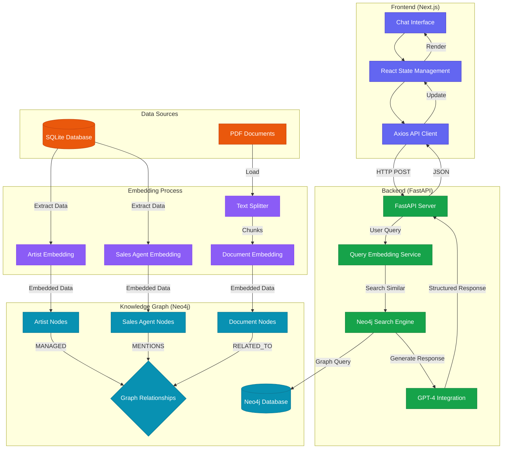

# GraphRAG System Architecture

## System Overview

GraphRAG combines knowledge graphs with RAG (Retrieval-Augmented Generation) to provide intelligent responses by leveraging both structured and unstructured data relationships.

## Architecture

## Architectural Flow

### 1. Data Ingestion and Embedding Phase

#### Raw Data Sources
- **SQLite Database**: Contains structured data about artists and sales agents
- **PDF Documents**: Holds unstructured contextual information

#### Data Processing
- Artist and agent data extraction from SQLite
- PDF documents are processed through Text Splitter for chunking
- Each data type undergoes specialized embedding creation

### 2. Knowledge Graph Population

#### Node Creation
- **Artist Nodes**: Contain embedded artist information and metadata
- **Sales Agent Nodes**: Store embedded agent data and relationships
- **Document Nodes**: Hold embedded document chunks with context

#### Relationship Establishment
- `MANAGED`: Links between agents and artists
- `MENTIONS`: Connections between documents and entities
- `RELATED_TO`: Inter-document relationships based on similarity

### 3. Query and Response Flow

#### User Interaction Layer
1. User inputs query through Chat Interface
2. React State Management handles input state
3. Axios API Client formats and sends HTTP POST request

#### Backend Processing
1. FastAPI server receives and processes query
2. Query Embedding Service creates vector embedding
3. Neo4j Search Engine:
   - Performs similarity search
   - Retrieves relevant graph context
   - Prepares data for LLM

#### Response Generation
1. GPT-4 generates contextual response
2. FastAPI formats response as JSON
3. Frontend receives and processes response
4. UI updates to display new information

### 4. System Benefits

- **Semantic Search**: Efficient similarity-based retrieval
- **Contextual Understanding**: Graph relationships enhance response relevance
- **Scalable Architecture**: Modular design for easy expansion
- **Real-time Processing**: Optimized for quick response times

### 5. Technical Stack

#### Frontend
- Next.js with TypeScript
- React State Management
- Axios for API communication
- TailwindCSS for styling

#### Backend
- FastAPI server
- OpenAI GPT-4 integration
- Neo4j Graph Database
- OpenAI Embeddings (Ada-002)

#### Data Processing
- Text splitting and chunking
- Vector embeddings
- Graph relationship management
- Similarity computation

## Conclusion

This architecture provides a robust foundation for:
- Efficient information retrieval
- Contextual response generation
- Scalable data processing
- Real-time user interactions

The system's modular design allows for easy updates and maintenance while ensuring optimal performance through its various specialized components.