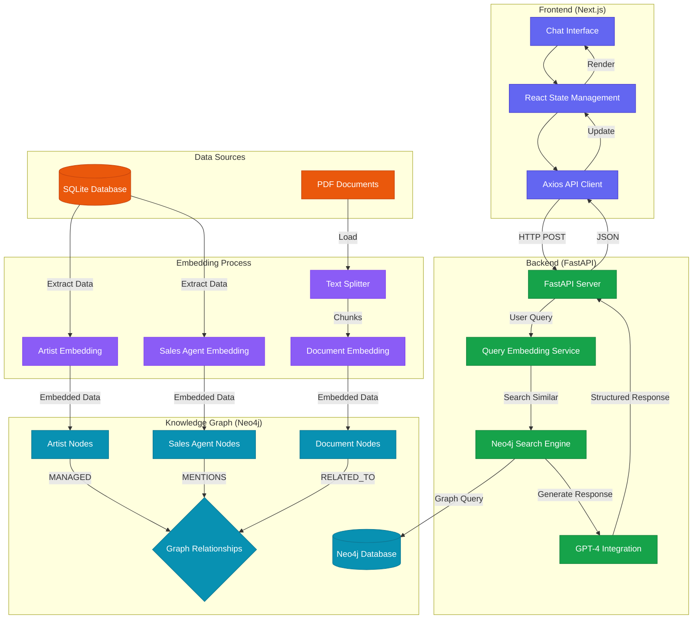

# GraphRAG 🔍

<div align="center">


An intelligent chatbot system combining Knowledge Graphs with RAG for enhanced contextual understanding.

[Features](#features) • [Architecture](#architecture) • [Installation](#installation) • [Usage](#usage) • [Contributing](#contributing)

</div>

## Table of Contents

- [Introduction](#introduction)
- [Features](#features)
- [Architecture](#architecture)
  - [Frontend](#frontend)
  - [Backend](#backend)
  - [Knowledge Graph](#knowledge-graph)
- [Installation](#installation)
  - [Prerequisites](#prerequisites)
  - [Setup](#setup)
- [Usage](#usage)
- [Contributing](#contributing)
- [Acknowledgements](#acknowledgements)
- [License](#license)

## Introduction

GraphRAG enhances traditional chatbots by leveraging Knowledge Graphs, combining structured and unstructured data into a comprehensive Graph Database. This approach enriches the standard RAG (Retrieval-Augmented Generation) system with relationship-aware context, enabling more accurate and contextual responses to complex queries.

## Features

- 🔍 **Advanced Query Understanding**: Utilizes graph-based context for better query comprehension
- 🧠 **Intelligent Response Generation**: Combines GPT-4 with graph-based knowledge retrieval
- 📊 **Knowledge Graph Integration**: Neo4j-powered data relationships
- 🎯 **Contextual Awareness**: Maintains context through graph relationships
- 💨 **Real-time Processing**: Fast response generation with optimized retrieval
- 🎨 **Modern UI**: Sleek interface built with Next.js and TailwindCSS

## Architecture

For a detailed understanding of the system architecture, data flow, and component interactions, please see our [detailed architecture documentation](architecture.md).



### Frontend
- **Framework**: Next.js with TypeScript
- **Styling**: TailwindCSS with custom animations
- **Components**: 
  - Chat interface with real-time updates
  - Markdown rendering for formatted responses
  - Loading states and animations

### Backend
- **API**: FastAPI server handling query processing
- **LLM Integration**: OpenAI GPT-4 for response generation
- **Embedding**: OpenAI Ada-002 for text embeddings
- **Database**: Neo4j for graph storage and querying

### Knowledge Graph
- **Database**: Neo4j Graph Database
- **Node Types**: 
  - Documents
  - Artists
  - Sales Agents
- **Relationships**: 
  - MENTIONS
  - MANAGED
  - RELATED_TO

## Installation

### Prerequisites

- Node.js (v18+)
- Python (v3.8+)
- Neo4j Database
- OpenAI API Key

### Setup

1. **Clone the repository**
```bash
    bash
    git clone https://github.com/yourusername/graphrag.git
    cd graphrag
```

2. **Frontend Setup**
```bash
    cd src/frontend
    npm install
```

3. **Backend Setup**
```bash
    cd src/backend
    python -m venv venv
    source venv/bin/activate # or venv\Scripts\activate on Windows
    pip install -r requirements.txt
```

4. **Neo4j Setup**
- Install Neo4j Desktop
- Create a new database
- Set password to '12345678' or update in configuration
- Start the database

5. **Environment Variables**
Create `.env` file in backend directory:
```bash
    OPENAI_API_KEY=your_api_key_here
    NEO4J_URI=bolt://localhost:7687
    NEO4J_USERNAME=neo4j
    NEO4J_PASSWORD=12345678
```

## Usage

1. **Start the Backend**
```bash
    cd src/backend
    uvicorn generateResponse:app --reload
```
2. **Start the Frontend**
```bash
    cd src/frontend
    npm run dev
```


3. **Access the Application**
Open [http://localhost:3000](http://localhost:3000) in your browser

## Contributing

1. Fork the repository
2. Create your feature branch (`git checkout -b feature/AmazingFeature`)
3. Commit your changes (`git commit -m 'Add some AmazingFeature'`)
4. Push to the branch (`git push origin feature/AmazingFeature`)
5. Open a Pull Request

## Acknowledgements

- OpenAI for GPT-4 and embeddings
- Neo4j for graph database
- Vercel for Next.js
- All contributors and supporters

## License

This project is licensed under the MIT License - see the [LICENSE](LICENSE) file for details.

---

Made with ❤️ by [@hrithikkoduri](https://github.com/hrithikkoduri)
